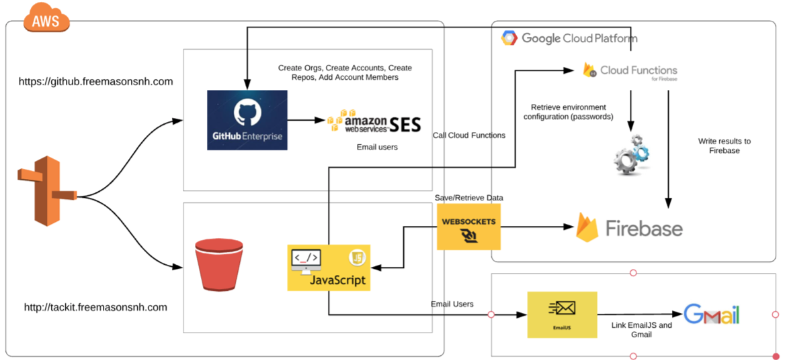

# tackIT

Your tool to speed up your development and focus on what you want, the business capabilities you're trying to provide!

### Link
https://freemassons.github.io/tackIT/

### Featuring
1. Custom account functionality, including:
  * New Account
  * Custom Teams!
  * Custom Avatar!
  * Email out reminder
  * Forgot Password
2. Chatbot!
  * Custom functionality to deliver new github enterprise features
  * Create new organization
  * Create new users
  * Create new repo
3. Chat!
  * Collaborate with your development team
  * Custom channels
  * Public or Private

### Technology Leveraged
1. Cloud
  * AWS: S3, EC2, and Route 53
  * Firebase Cloud Functions
2. API  
  * emailJS
  * Github
  * Cloud Functions
3. Libraries
  * emailJS
  * cryptoJS
  * materialize (JS & CSS)
  * momentJS
  * jQuery

### Architecture Diagram

Join in the fun today!